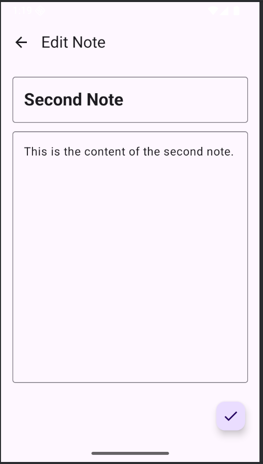
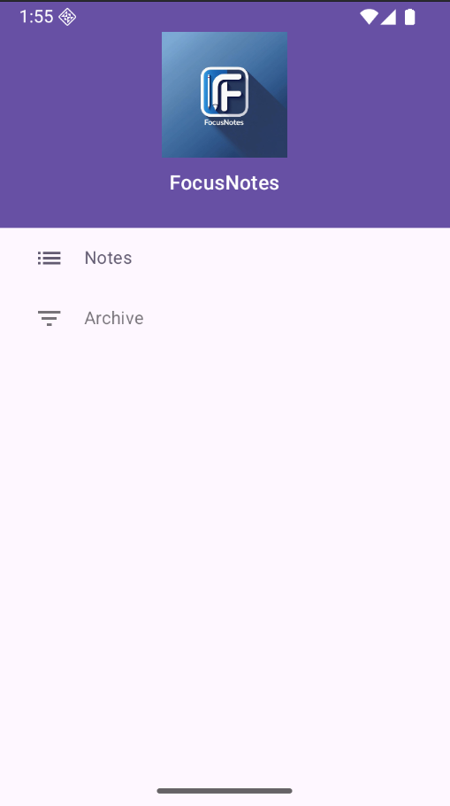
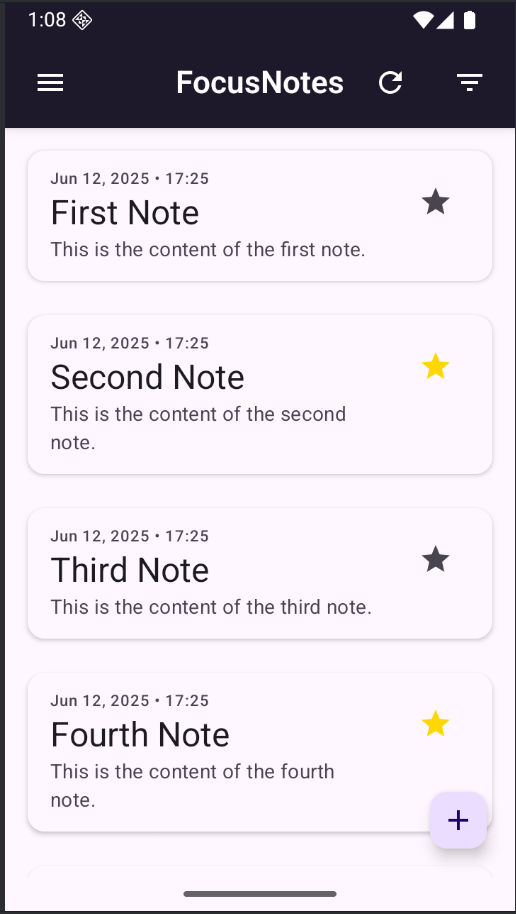
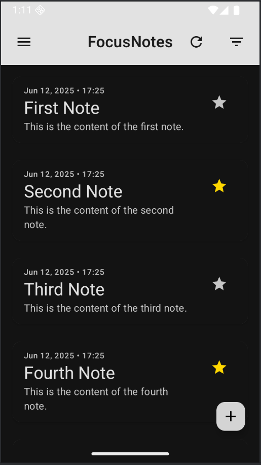

# 📝 Focus Notes – Jetpack Compose Note-Taking App

A clean, minimal note-taking app built using **Kotlin** and **Jetpack Compose**.

This project is a complete implementation of:
- Jetpack Compose UI
- MVVM architecture
- Room Database
- Hilt Dependency Injection
- Material Theming + Dark Mode
- Navigation

---

## 📚 Learn How It Was Built – Free Course

This app was built as part of my **free Udemy course** on modern Android development with Jetpack Compose.

👉 [Android App Development with Kotlin & Jetpack Compose – Free on Udemy](https://www.udemy.com/course/android-app-development-with-kotlin-jetpack-compose/?couponCode=JETPACKBLAST)

The course walks you through:
- Kotlin basics for Android
- Building UI using Jetpack Compose
- MVVM architecture from scratch
- Data persistence with Room DB
- Dependency Injection with Hilt
- App theming & state handling

---
## 📸 Screenshots

Here are a few screens from the Focus Notes app:

  
  
  


---

## 🧱 Tech Stack

- Kotlin
- Jetpack Compose
- Room
- Hilt
- AndroidX
- Material3

---

## 📁 Project Structure

```
app/
├── data/          # Room DB, Repositories
├── domain/        # Models & UseCases
├── ui/            # Compose Screens, Components
├── di/            # Hilt Modules
└── MainActivity.kt
```

---

## ✅ Features

- Add / Edit / Delete notes
- Clean UI with Jetpack Compose
- Full offline support with Room
- Hilt-based Dependency Injection
- Responsive Dark Theme

---

## 🏁 Getting Started

1. Clone the repo:
   ```bash
   git clone https://github.com/devsoftware116/focus-notes-jetpack-compose.git
   ```

2. Open in Android Studio

3. Run on an emulator or physical device (min SDK 24)

---

## 💡 License

This project is licensed under the MIT License. Feel free to use and modify it.

---

## 🙋‍♂️ Questions?

Feel free to open an issue or reach out on [LinkedIn](https://www.linkedin.com/in/devc/) or via the [course Q&A section](https://www.udemy.com/course/android-app-development-with-kotlin-jetpack-compose/?couponCode=JETPACKBLAST).
